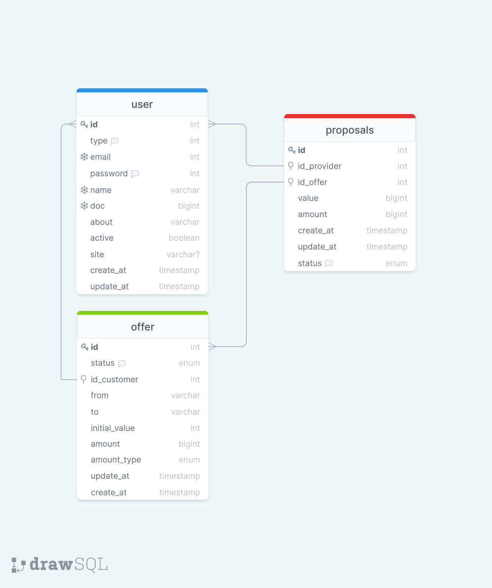
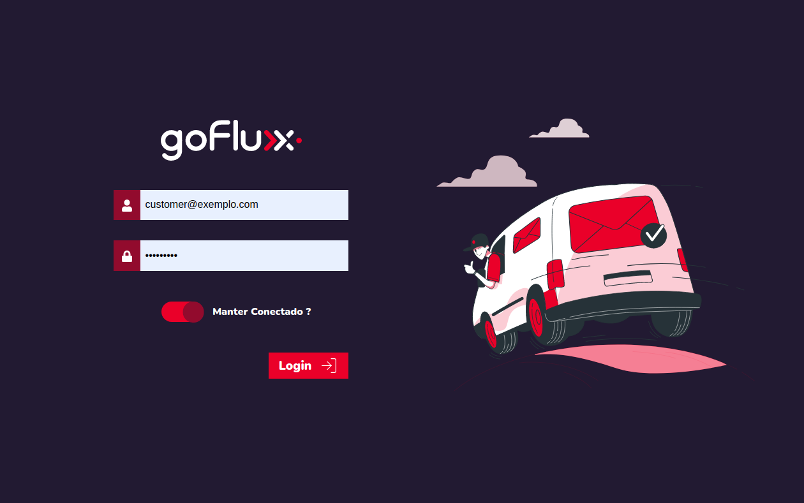
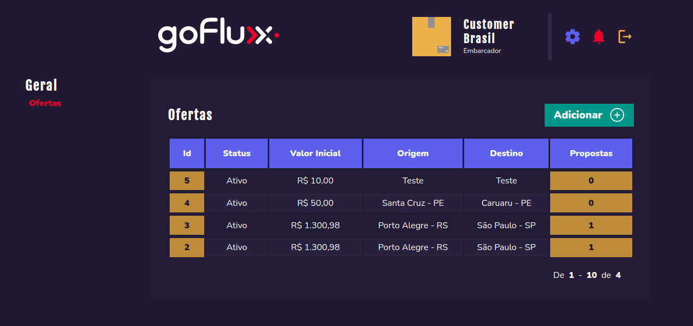
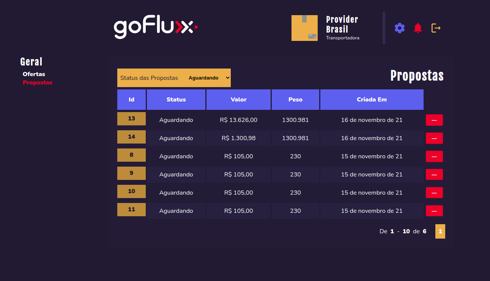

# Desafio Técnico GoFlux - FullStack

O Objetivo do reste era desenvolver uma API  REST  pra cadastrar informações sobre ofertas de serviços de entrega e propostas para essas , assim como os Transportadores e Embarcadores.

> Para o desenvolvimento foi utilizado do docker  usando uma [imagem oficial](https://hub.docker.com/_/postgres) do **Postgres**  

## Stack Utilizada - Backend

| Tecnologia                    | Detalhes                                         |
| ----------------------------- | ------------------------------------------------ |
| Typescript                    | Superset da linguagem de programação Javascript  |
| Node.js                       | Poderoso Interpretador Javascript                |
| Postgresql (Container Docker) | Banco de Dados Opensource                        |
| Express                       | Framework para desenvolvimento web com o Node.js |

## Stack Utilizada - Front-end

| Tecnologia        | Detalhes                                                     |
| ----------------- | ------------------------------------------------------------ |
| React.js          | Framework par desenvolvimento front-end                      |
| Typescript        | Superset da linguagem de programação Javascript              |
| styled-components | Biblioteca que permite a escrita de css/scss  em conjunto do aquivos typescript |
| axios             | Biblioteca de Cliente http                                   |

# Estrutura do Banco de Dados

 

# Telas 

## Login

## Dashboard - Embarcadores

## Dashboard - Transportadores

